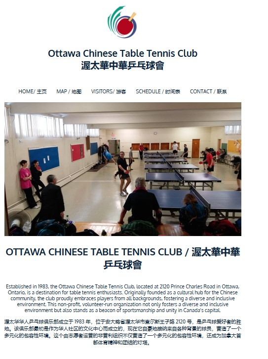

# Ottawa Chinese Table Tennis Club Website

A simple and informative website for the **Ottawa Chinese Table Tennis Club** created using HTML and CSS. This website is information display for the club's members and visitors, showcasing information about the club, its history, schedule, location, and contact details.

## Features

- **Responsive Design:** The website is designed to adapt to various screen sizes 
- **Multilingual Support:** Includes both English and Chinese text 
- **Club Details:** Highlights the club's history, values, and schedule

## Demo



## Project Structure
```
├── images/          # Folder of images used in the website 
├── index.html       # Main HTML file
├── style.css        # CSS file for styling
└── table_logo.psd   # Photoshop file for the club logo
```

## Tech Stack
- HTML
- CSS
- JavaScipt

## License
This project is licensed under the MIT License
